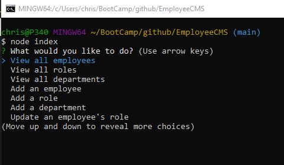

# EmployeeCMS
Content Management System to track employees, departments, and roles.

## Summary
The EmployeeCMS app runs under NodeJs to enable a non-technical user to easily view and interact with information stored in the database of employee data. The app manages a company's employee database, using Node.js, Inquirer, and MySQL.

## Features

```
* This is a command-line application that accepts user input
* The app gives the user the ability to view all departments, view all roles, view all employees, add a department, add a role, add an employee, and update an employee role
* The app allows the user to view all departments with a formatted table showing department names and department ids
* The app allows the user to view all roles, showing the job title, role id, the department that role belongs to, and the salary for that role
* The app allows the user to view all employees with a formatted table showing employee data, including employee ids, first names, last names, job titles, departments, salaries, and managers that the employees report to
* The app allows the user to add a department.  The user is prompted to enter the name of the department and that department is added to the database
* The app allows the user to add a role.  The user is prompted to enter the name, salary, and department for the role and that role is added to the database
* The app allows the user to add an employee.  The user is prompted to enter the employee’s first name, last name, role, and manager, and that employee is added to the database
* The app allows the user to update an employee role.  The user is prompted to select an employee to update and their new role and this information is updated in the database 
```

## Walkthrough video

The following video shows an example of the application being used from the command line:
[walkthrough video thumbnail](https://watch.screencastify.com/v/P1dwg5RPuzw7Bm4yUr5T)

## Screenshot


## Options on main menu
* View all employees
* View all roles
* View all departments
* Add employee
* Add role
* Add a department
* Update an employee's role

## Database schema
* `department`
    * `id`: `INT PRIMARY KEY`
    * `name`: `VARCHAR(30)`

* `role`
    * `id`: `INT PRIMARY KEY`
    * `title`: `VARCHAR(30)`
    * `salary`: `DECIMAL`
    * `department_id`: `INT`

* `employee`
    * `id`: `INT PRIMARY KEY`
    * `first_name`: `VARCHAR(30)`
    * `last_name`: `VARCHAR(30)`
    * `role_id`: `INT`
    * `manager_id`: `INT`

## Bonus features not yet implemented
* Update employee managers.
* View employees by manager.
* View employees by department.
* Delete departments, roles, and employees.
* View the total utilized budget of a department&mdash;in other words, the combined salaries of all employees in that department.
